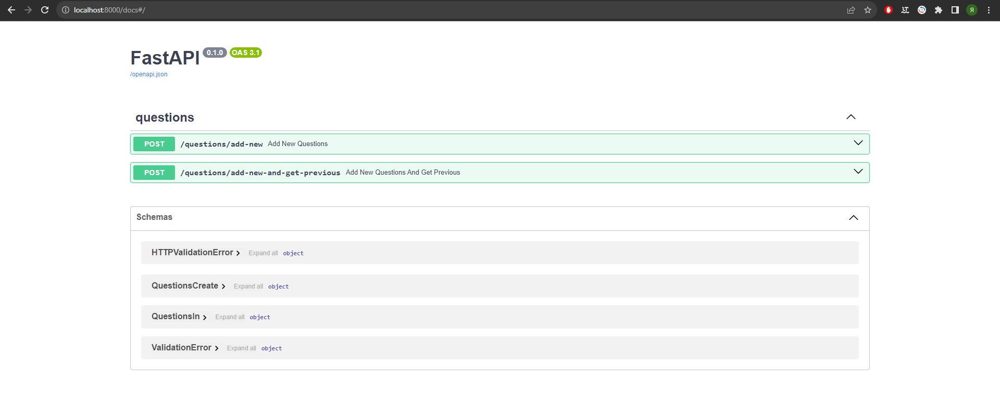

# Quiz question
### By Kobyakov Yaroslav

## Prerequisites:
- Docker
- Docker Compose
- Python 3.8+
- FastAPi
- postgresSQL
- alembic
- pytest
- pip
- Git

## Getting Started
### Environment Setup
1. Clone the repository:
    ```commandline
    git clone https://github.com/YaraKoba/quiz-questions.git
    cd quiz-questions
    ```
2. Create a `.env` file in the project root directory and add the necessary environment variables. You can use the `.env.sample` file as a template.

### Running the Application
1. Start the application and PostgreSQL database with Docker Compose:

    ```commandline
    docker-compose up -d
    ```
2. Run Alembic database migrations to set up the database schema:
    ```commandline
    docker-compose exec web alembic upgrade head
    ```
3. Check it. Now you can go to http://127.0.0.1/docs. You will see the automatic interactive API documentation



## API

1. `POST /questions/add-new` - this endpoint with content {"questions_num": integer} where `0 < integer <= 100`. The service requests from the public API `https://jservice.io/api/random?count=1` the number of questions specified in the received request. If there is the same question in the database, the service will send repeated requests to the public API until a unique question for the quiz is received. return added questions


## Tests

Run this comand:
```commandline
pytest
```
tests files in `app/tests`
